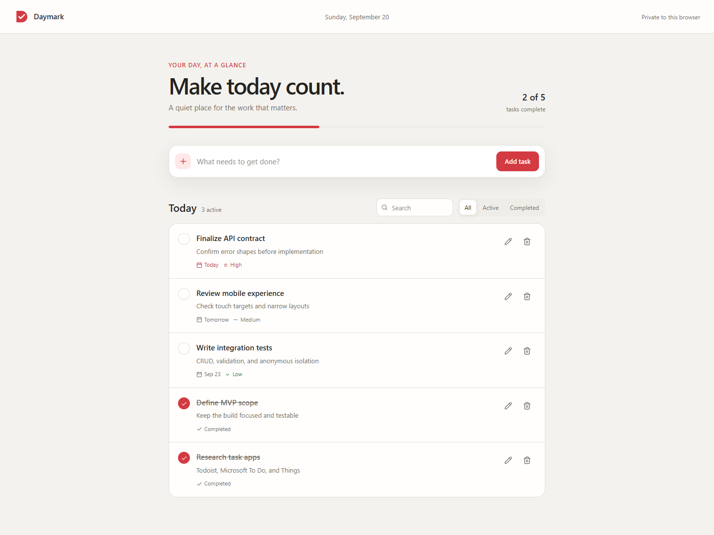

# Daymark

Daymark is a polished, login-free MERN task manager built for the ShopBack take-home assignment. It supports complete task CRUD, completion and reopening, MongoDB persistence, search, status filters, priorities, due dates, progress, responsive layouts, and anonymous browser-level list isolation.

**Live demo:** [daymark-todo.netlify.app](https://daymark-todo.netlify.app/)



## Reviewer experience

A reviewer can open the Netlify URL and use the app immediately—there is no signup, login, seed step, or browser configuration. The first visit creates a random browser ID; all later requests use it automatically, and tasks remain available after refresh.

Each browser profile receives a separate task list. This is convenient anonymous partitioning for the exercise, not authentication: the same person on another browser or device will receive a new list.

## Features

- Add tasks with a required title and optional note, due date, and priority.
- Edit or delete tasks with validation and a clear confirmation step.
- Complete and reopen tasks with live count and percentage progress.
- Search titles and notes, then filter by all, active, or completed.
- Persist every successful change in MongoDB.
- Handle loading, empty, no-results, validation, and recoverable API error states.
- Work at mobile and desktop widths with keyboard-visible focus and reduced-motion support.
- Isolate multiple anonymous users without collecting names, emails, or passwords.

## Tech stack

- React 19 and Vite 8
- Node.js and Express 5
- MongoDB Atlas and Mongoose 9
- Netlify static hosting and Netlify Functions
- Vitest, React Testing Library, user-event, Supertest, and mongodb-memory-server

## Run locally

### Prerequisites

- Node.js 20.19 or newer.
- pnpm 10.22.0 (`corepack enable` reads the pinned version from `package.json`).
- A MongoDB connection string. MongoDB Atlas or a local MongoDB instance both work.

### Setup

1. Install dependencies from the repository root:

   ```bash
   pnpm install
   ```

2. Copy `.env.example` to `server/.env`, then set `MONGODB_URI`:

   ```env
   PORT=5000
   MONGODB_URI=mongodb://127.0.0.1:27017/shopback_todo
   CLIENT_ORIGIN=http://localhost:5173
   ```

   This workspace is already configured with the assignment's Atlas database. `.env` files are ignored so the credential is not accidentally committed.

3. Start the API and React client together:

   ```bash
   pnpm dev
   ```

4. Open `http://localhost:5173`.

Vite proxies `/api` to `http://localhost:5000` during local development. `VITE_API_URL` is only needed if the client and API are deliberately hosted on different origins.

## Commands

```bash
pnpm dev          Start the React client and Express API
pnpm lint         Lint the complete repository
pnpm test         Run all 44 server and client tests
pnpm test:server  Run the 27 API/model tests
pnpm test:client  Run the 17 React/client tests
pnpm build        Create the production client build
```

The first server test run may download a temporary MongoDB binary. Tests use that isolated process and do not read from or modify the development Atlas database.

## Deploy to Netlify

The repository is deployment-ready. `netlify.toml` builds `client/dist`, packages the Express app as one Netlify Function, rewrites `/api/*` to that function, and keeps the final catch-all rewrite for the React single-page app. The client therefore uses the same `/api` URLs locally and in production.

### Recommended: Netlify dashboard

1. Push the repository to GitHub, GitLab, or Bitbucket.
2. In Netlify, choose **Add new project → Import an existing project** and select the repository.
3. If Netlify asks which monorepo application to use, select `client`. Leave the base directory unset; the checked-in `netlify.toml` supplies the build, publish, function, and rewrite settings from the repository root.
4. In **Project configuration → Environment variables**, add `MONGODB_URI` with the Atlas connection string. Mark it as a secret. Do not add `VITE_API_URL`.
5. In MongoDB Atlas Network Access, allow connections from the deployed function. For a short-lived take-home demo, the straightforward option is `0.0.0.0/0` with a database user restricted to this demo database; remove the rule and rotate the credential after the review period.
6. Deploy the site, open `/api/health`, and confirm it returns `{"status":"ok"}`.
7. Add the generated `https://<project-name>.netlify.app` URL to the **Live demo** line at the top of this file.

Netlify environment variables must be configured in the dashboard, CLI, or API; putting a secret in `netlify.toml` does not expose it to Functions. Environment-variable changes require a new deploy.

### Optional: Netlify CLI

After installing and signing in to the Netlify CLI:

```bash
netlify init --filter client
netlify env:set MONGODB_URI "your-mongodb-connection-string" --secret
netlify deploy --build --prod --filter client
```

For a production-like local check, run `netlify dev --filter client` after linking the project and setting the environment variable.

## Architecture

```text
Browser (React)
  └─ X-Client-ID header + JSON over /api
       ├─ local: Vite proxy → Express server
       └─ Netlify: rewrite → Express serverless function
                              └─ Mongoose → MongoDB Atlas
```

The client creates a UUID with `crypto.randomUUID()`, stores it in local storage, and sends it as `X-Client-ID`. The server validates that value and includes `ownerId` in every list, update, and delete query. `ownerId` is never accepted from request JSON.

API surface:

| Method | Path | Purpose |
| --- | --- | --- |
| `GET` | `/api/health` | Runtime health check |
| `GET` | `/api/tasks` | List the current browser's tasks |
| `POST` | `/api/tasks` | Create a task |
| `PATCH` | `/api/tasks/:id` | Edit, complete, or reopen a task |
| `DELETE` | `/api/tasks/:id` | Delete a task |

See [docs/api.md](docs/api.md) for the complete request and response contract.

## Project structure

```text
client/             React UI, browser identity, API client, and component tests
server/             Express API, Mongoose model, middleware, and API tests
netlify/functions/  Production serverless adapter for the Express app
docs/               API contract and approved interactive wireframes
design-theme/       Brand assets, tokens, written spec, and live theme editor
screenshots/        Desktop and mobile application screenshots
netlify.toml        Build, Functions, rewrite, and response-header configuration
plan.md             Chronological implementation phases and test gates
```

## Verification completed

- 27 server model/API tests passed.
- 17 client utility/component tests passed.
- Repository lint passed.
- Vite production build passed.
- Netlify's local production build passed and bundled the API Function.
- The supplied Atlas cluster passed a create → list → complete → delete persistence smoke test; temporary records were removed.
- Browser CRUD and refresh persistence passed against a real temporary MongoDB process.
- Desktop at 1440 px and mobile at 390 px passed with no horizontal overflow or browser errors.

## Submission artifacts

- Requirements: [REQUIREMENTS.md](REQUIREMENTS.md)
- Implementation and test plan: [plan.md](plan.md)
- Original prompt: [prompt.md](prompt.md)
- AI usage reflection: [reflection.md](reflection.md)
- Desktop and mobile screenshots: [screenshots/](screenshots/)
- Editable design review: [design-theme/design-theme.html](design-theme/design-theme.html)
